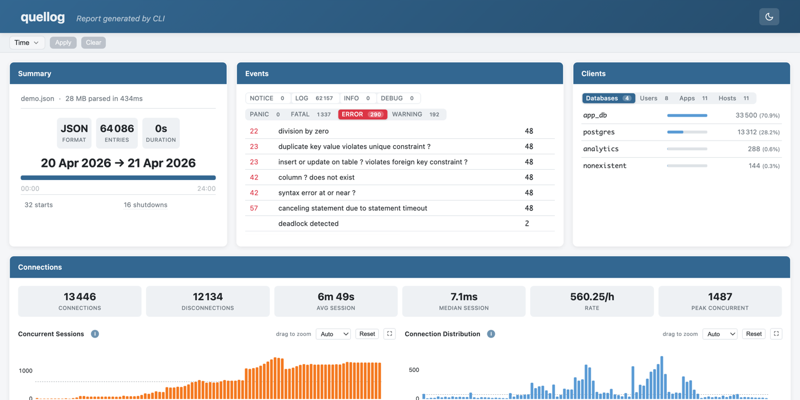
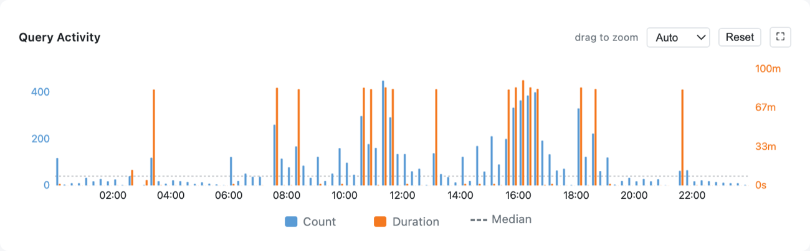
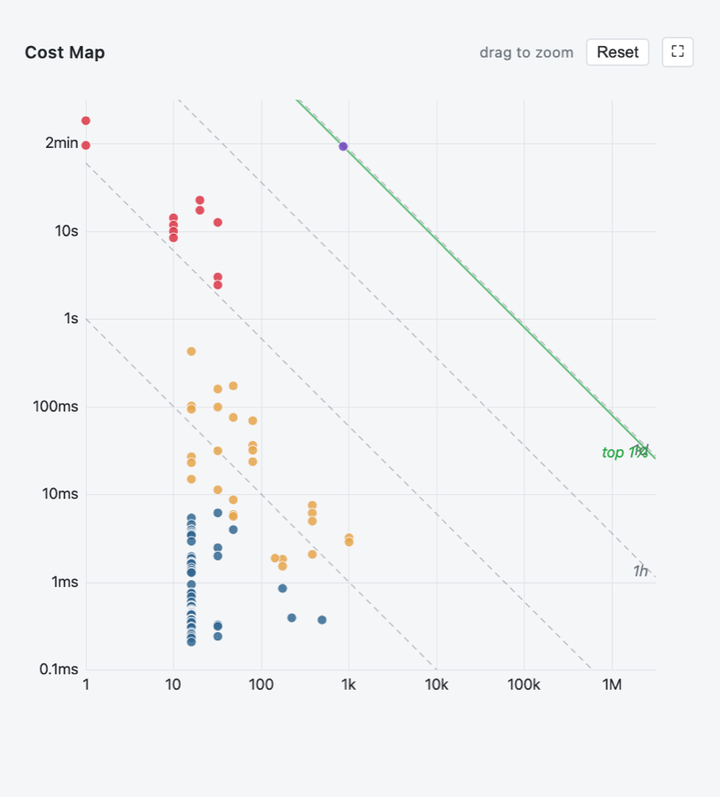
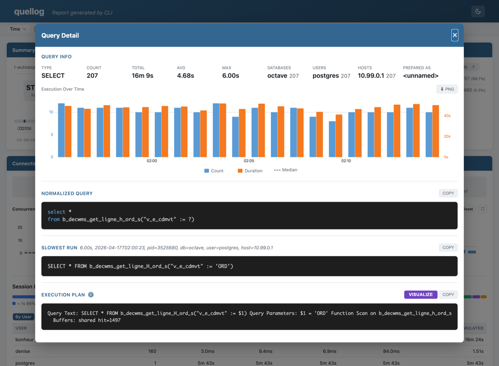
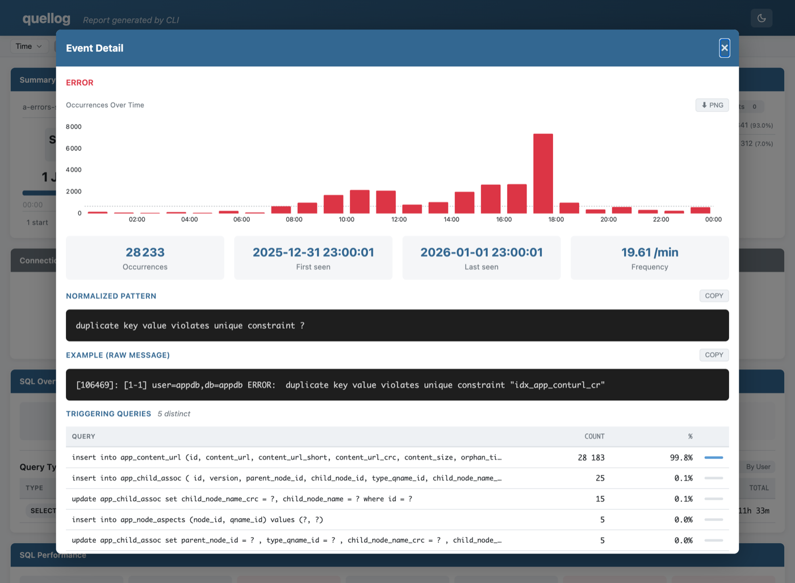
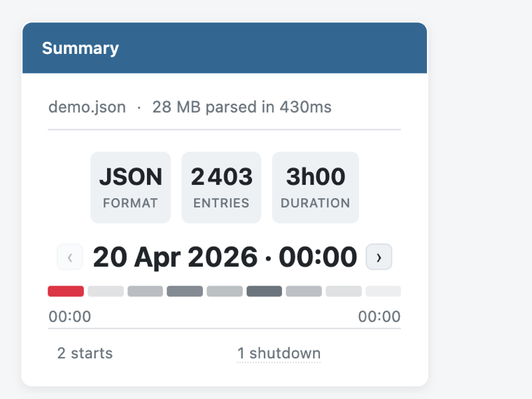

# HTML Report

quellog's HTML report is a single, self-contained file: open it in any browser, no server, fully offline. Everything — filtering, zooming, drilling into a query — happens client-side in the page.

!!! tip "Try it now"
    **[Open the interactive demo →](https://alain-l.github.io/quellog/demo.html)** — drop a PostgreSQL log file and explore. All processing runs locally in your browser.

## Generating the report

```bash
quellog /var/log/postgresql/postgres.log --html          # → postgres.html
quellog /var/log/postgresql/*.log --html -o report.html  # explicit name
quellog /var/log/postgresql/*.log --html --full          # all sections
quellog /var/log/postgresql/*.log --html --open          # open it in the browser
```

The default name is `<stem>.html` for a single input, `quellog.html` for multiple inputs or stdin. `--open` launches the default browser (skipped when stderr is not a TTY or `CI` is set). The HTML report can also be produced alongside other formats in a single pass — see [Export Formats](exports.md).

## Anatomy

{ width="820" }

A header (file name, theme toggle), a client-side filter bar, then the **Summary** tile and the analysis sections — Events, SQL Performance, Connections, Maintenance, and the rest. These are the same sections as the text report ([Report Sections](default-report.md)), rendered interactively.

## Summary tile

The eyebrow line shows format, total size, parse time and the date range; a full-width bar marks the data span. When the report is split into periods, this tile also carries the period navigator (see [below](#period-split-reports-split)).

## Client-side filters

The filter bar filters the **whole** report by database, user, application, host and time range. Applying a filter re-renders every section and chart instantly, in the browser — no need to re-run quellog.

## Interactive charts

Every time-series chart shares the same toolbar:

{ width="820" }

- **drag to zoom** — drag horizontally to zoom into a time window.
- **double-click** or **Reset** — restore the full range.
- **interval selector** (Auto / 1 min / 5 min / …) — change the bucket width.
- **⛶** — expand the chart in a large modal, where **⬇ Export PNG** saves it as an image.
- legend entries toggle a series on/off.

Charts include Query Activity (count + cumulated duration), Concurrent Sessions, Connection Distribution, Checkpoints, WAL distance, and Temp File activity.

## Cost map

Under SQL Performance, the **cost map** plots every query (TCL excluded) on log-log axes — execution count (X) against average duration (Y):

{ width="560" }

- Each dot is a normalized query, coloured by its **cumulative** time (count × avg) in four buckets (low → extreme).
- The dashed **iso-cost** diagonals mark constant cumulative time (1s / 1min / 1h / 1d); the solid green **top 1% / 10%** lines are Pareto thresholds — dots above and to the right account for that share of total query time.
- Hover a dot for its figures and to highlight its row in the query table (and the reverse); click to open its detail. Drag to zoom, double-click to reset, **⛶** to expand.

Heavy hitters sit toward the top-right, so the map answers "which queries cost the most overall?" at a glance.

## Query tables and detail

The query tables (By Total Time / Slowest / Most Frequent, plus a TCL tab) are sortable. Click any row — or any cost-map dot — for the **query detail** modal:

{ width="820" }

It cross-references every analyzer for that query: duration distribution and an execution-over-time chart, top databases / users / applications / hosts, prepared-statement names, the slowest run with its actual parameter values, the temp files and locks it caused, and the captured execution plan (with a **Visualize** button to [explain.dalibo.com](https://explain.dalibo.com)). Normalized and example queries have copy buttons.

## Event detail

Click any event row for the **event detail** modal:

{ width="820" }

It shows the normalized pattern and the raw example (both with copy buttons), an occurrences-over-time sparkline, first/last seen and frequency, the SQLSTATE class, and — when the offending statements were logged — the **triggering queries** ranked by share.

## Maintenance and other widgets

The Maintenance section splits AUTOVACUUM and AUTOANALYZE into tab-switchable, sortable tables; a long table name expands on click. Connections add the concurrent-sessions chart and session breakdowns by user / database / host.

## Period-split reports (`--split`)

`--split <interval>` turns one run into a **single** HTML report partitioned into selectable time periods. Each period is analyzed independently, so its numbers match a run scoped to that window with `--begin`/`--end`.

{ width="380" }

The Summary tile gains a **period navigator** with a volume heatmap — one cell per period, coloured by entry count. Click a cell (or the ‹ › arrows) to switch period; nothing reloads.

```bash
quellog /var/log/postgresql/*.log --html --split 1d   # one period per day
quellog logs/2026-02-*.log        --html --split 3h   # 3-hour periods
quellog busy-hour.log             --html --split 5m   # 5-minute periods
```

The interval takes the same units as `--last` (`s`, `m`, `h`, `d`, `w`, `y`), one unit at a time (`90m`, not `1h30m`). Periods align to the log's **wall clock** — `1d` to local midnight, `3h` to 00:00/03:00/06:00…, `5m` to :00/:05/:10 — independent of the machine timezone.

- **Requires `--html`**, and cannot be combined with the other export formats or with `--follow`. Only the full report is supported (not `--sql-detail`, `--event-detail`, `--sql-performance`, `--sql-overview`).
- Filters (`--begin`/`--end`, `--dbname`, …) apply **before** splitting, so periods cover only what passes the filters.
- At most 400 periods are produced; a too-fine interval over a long range is rejected — use a coarser one.

## Theme

A light/dark toggle in the header switches the whole report; it follows the operating-system preference by default.
